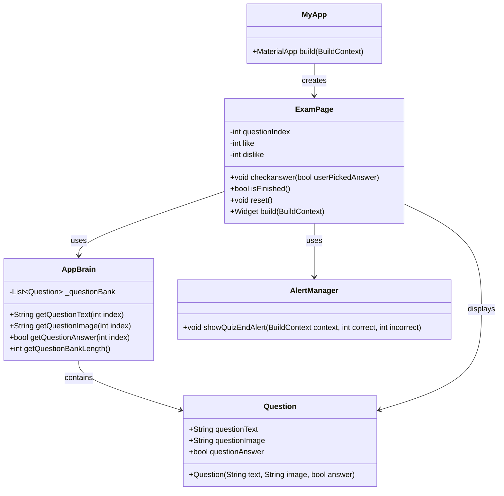

# flutter_truefalse_quiz

Application mobile Flutter interactive permettant à l'utilisateur de répondre à une série de questions de type True or False (Vrai ou Faux). À la fin du quiz, l'application affiche le score total, le nombre de réponses correctes et incorrectes, ainsi qu'une évaluation du niveau de performance de l'utilisateur.

## Captures d'écran

### Écran du quiz


### Écran de résultats


## Fonctionnalités

- **Quiz interactif** : Questions avec images et texte
- **Système de scoring** : Suivi des réponses correctes et incorrectes
- **Interface intuitive** : Boutons Vrai/Faux avec feedback visuel
- **Alertes de fin de quiz** : Résumé des performances avec option de réinitialisation
- **Design responsive** : Adapté aux différentes tailles d'écran

## Architecture Technique

### Structure du projet
```
flutter_truefalse_quiz/
├── lib/
│   ├── main.dart          # Point d'entrée et logique du quiz
│   ├── question.dart      # Modèle de données Question
│   └── Appbrain.dart      # Gestionnaire de questions
├── images/                # Ressources images
├── android/               # Configuration Android
├── ios/                   # Configuration iOS
└── pubspec.yaml          # Dépendances du projet
```

### Technologies utilisées
- **Flutter** 3.8.1+ : Framework de développement multiplateforme
- **Dart** : Langage de programmation
- **rflutter_alert** 2.0.7 : Bibliothèque pour les alertes dialog
- **Material Design** : Interface utilisateur native

## Diagramme UML



## Installation et Exécution

### Prérequis
- Flutter SDK 3.8.1 ou supérieur
- Dart SDK
- Android Studio / VS Code avec extensions Flutter
- Émulateur Android ou appareil physique

### Étapes d'installation

1. **Cloner le repository**
   ```bash
   git clone [repository-url]
   cd flutter_truefalse_quiz
   ```

2. **Installer les dépendances**
   ```bash
   flutter pub get
   ```

3. **Vérifier la configuration**
   ```bash
   flutter doctor
   ```

4. **Exécuter l'application**
   ```bash
   flutter run
   ```

## Utilisation

1. **Lancer le quiz** : L'application démarre automatiquement sur la première question
2. **Répondre aux questions** : Appuyer sur "Vrai" ou "Faux" selon votre réponse
3. **Suivre le score** : Les icônes pouce levé/baissé affichent le score en temps réel
4. **Finaliser le quiz** : À la fin, une alerte affiche les résultats
5. **Recommencer** : Utiliser le bouton "Réinitialiser" pour relancer le quiz

## Modèle de données

### Classe Question
```dart
class Question {
  String questionText;    // Texte de la question
  String questionImage;   // Chemin de l'image associée
  bool questionAnswer;    // Réponse correcte (true/false)
}
```

### Flux de données
1. **AppBrain** gère la banque de questions
2. **ExamPage** contrôle l'état du quiz (index, scores)
3. **Question** structure les données individuelles
4. **Interface utilisateur** affiche et collecte les réponses

## Personnalisation

### Ajouter de nouvelles questions
Modifier `Appbrain.dart` pour ajouter des questions à la banque :

```dart
_questionBank.add(Question(
  questionText: "Votre nouvelle question",
  questionImage: "images/new-image.jpg",
  questionAnswer: true,
));
```

### Modifier l'apparence
- **Couleurs** : Modifier les couleurs dans `main.dart`
- **Polices** : Ajouter des polices personnalisées dans `pubspec.yaml`
- **Images** : Remplacer les images dans le dossier `images/`

## Plateformes supportées

- Android
- iOS  
- Web
- Windows
- macOS
- Linux

## Dépannage

### Problèmes courants
- **Images non affichées** : Vérifier que les images sont déclarées dans `pubspec.yaml`
- **Erreur de dépendances** : Exécuter `flutter pub get`
- **Problème de build** : Nettoyer avec `flutter clean` puis `flutter pub get`

## Licence

Ce projet est sous licence MIT.

## Auteur

Développé avec Flutter et Dart pour une expérience utilisateur optimale.

---
**Version** : 1.0.0+1  
**Dernière mise à jour** : 2024
